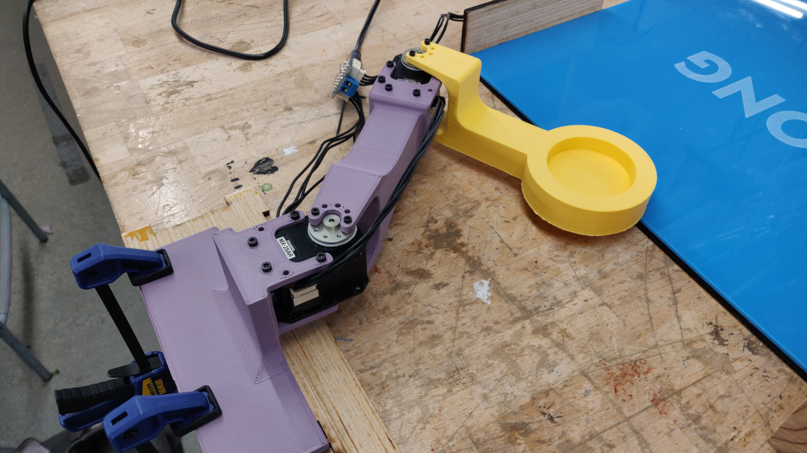
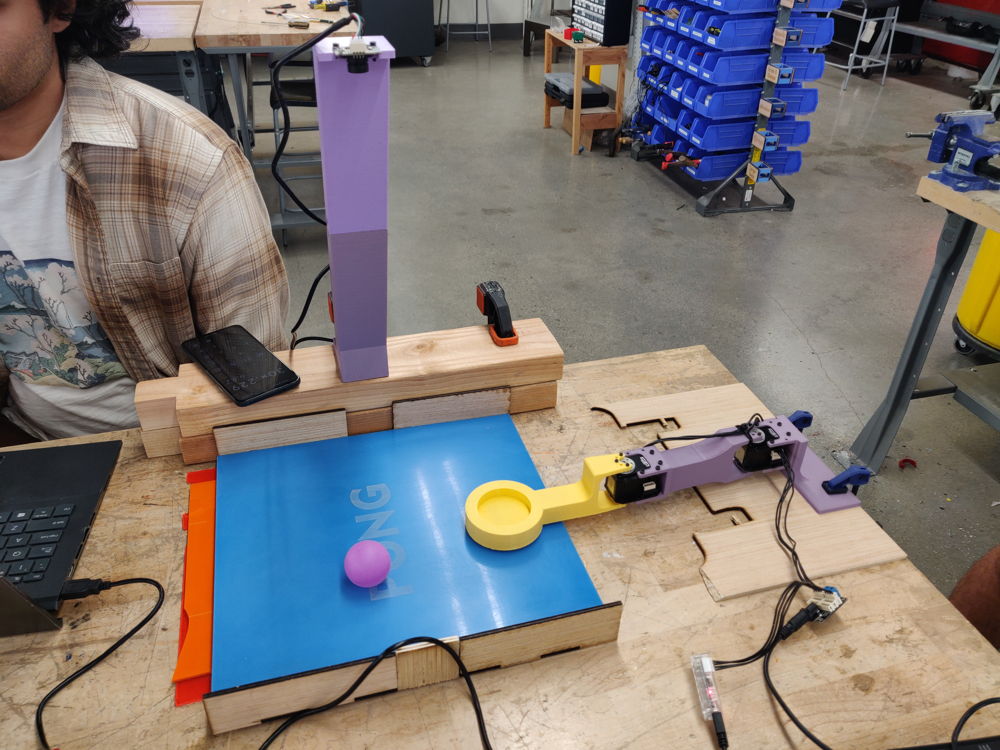
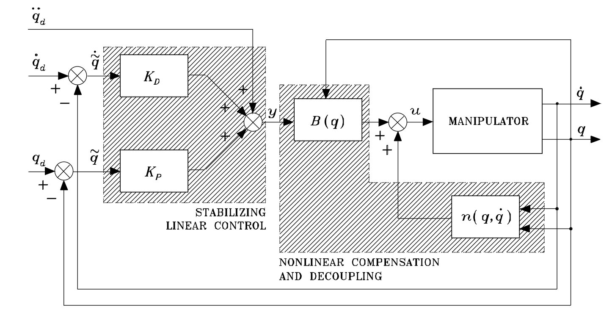

# 2R Planar Robot Paddle Project

My first successful hands-on project for a dual enrollment Robotic Systems project at Chaffey College, my group opted to create the 2R planar arm playing a game similar to air hockey or Pong.
We were given a robotics kit that included several DYNAMIXEL stepper motors and were tasked with creating a system to demonstrate our understanding of controls as taught in our course. Our group opted to design and build a 2-Degree-of-Freedom (2-DoF) planar robotic arm to play an interactive game similar to air hockey or Pong. 

The system operates autonomously by analyzing a top-down workspace view via a camera, running predictive trajectory models to intercept a moving ball, and executing dynamic joint-torque control algorithms to swing the arm and swat the ball back across the arena. I was largely responsible for programming the robot's behavior with Python and implementing its vision processing with OpenCV.

For structural reference and spatial orientation of the setup, see the layout configurations documented in arena.jpg and arm.jpg.

---
## Media

<video src="media/showcase.mp4" autoplay loop muted playsinline width="100%"></video>

---

## Mechanical Design & Hardware Assembly

The physical system was assembled to isolate movement strictly to a two-dimensional, flat workspace while ensuring structural rigidity under high motor accelerations.

* **Actuators:** The robot's kinematic chain relies on two high-performance DYNAMIXEL smart stepper motors arranged in a serial 2R configuration. These actuators handle positioning while providing internal absolute encoder feedback.
* **Linkage & Chassis Material:** The arm links, structural brackets, and motor mounts were 3D-printed. We selected a light purple PLA filament for the main links and a contrasting bright yellow filament for the end-effector.
* **Rigid Base Mounting:** Because the motors generate sudden torque spikes during high-speed swings, we clamped the primary base mount directly to the wooden workbench using heavy-duty industrial bar clamps to prevent base compliance or wobbling.
* **End-Effector Geometry:** The paddle features a circular, ring-like geometry optimized to maximize the effective striking surface area during high-speed impact sweeps.
* **The Arena Surface:** The game board consists of a smooth, low-friction blue sheet enclosed by wooden boundary walls. Instead of keeping it perfectly flat, we purposely added a slight longitudinal tilt to the table. This layout allows gravity to naturally pull the ball back down toward the robot's striking zone, keeping the gameplay loop running continuously without manual resets.

---

## Computer Vision Pipeline & Live Telemetry

The entire software backend is written in Python, using OpenCV to capture frames, process binary masks, track object centroids, and render real-time tracking data. 

Our video output features a split-screen view: a separately recorded physical perspective on the right, and the primary camera's live processing view on the left, which overlays several critical control and tracking variables.

[Raw Video Frame] ──> [HSV Color Segmentation] ──> [Centroid Extraction] ──> [Velocity Prediction Line]
                                                                                      │
[Live Motor Encoders] ──> [Forward Kinematics] ──> [Meters-to-Pixels Conversion] ──> [Red Actual Circle Overlay]

The live graphics stream maps four critical state indicators directly onto the visual frame:
1. **Tracked Ball Position:** Centroid pixel markers drawn directly over the moving purple ball using real-time HSV color segmentation.
2. **Predicted Ball Path:** A calculated trajectory line showing where the ball is going, allowing the robot to pre-position its paddle.
3. **Desired Position (Yellow Circle):** A user-interface marker representing the target position where our trajectory planning algorithm wants the paddle to go.
4. **Actual Position (Red Circle):** A real-time calculated marker indicating where the paddle physically is. The script reads the raw angular positions from the motor encoders, processes them through a **Forward Kinematics** model to get the $(x, y)$ coordinate in meters, and then runs a pixel conversion matrix to draw the circle exactly over the physical paddle on-screen.

---

## Control Theory & Algorithm Implementation

The mathematical backbone of our joint space control loop comes from the course textbook, *Robotics: Modeling, Planning, and Control* by Siciliano et al. Because this project was a capstone assignment for a controls class, we implemented and benchmarked three variations of an **Inverse Dynamics Control Loop** to observe the performance differences on real hardware:

### 1. Simplified Inverse Dynamics (Constant/Average Inertia)
This served as our primary baseline. This model simplifies the math by completely ignoring the Christoffel terms (Coriolis and centrifugal forces, denoted as $n$ in textbook control loops). It also treats the system's inertia matrix $B$ as a constant baseline average rather than updating it dynamically based on the arm's instantaneous shape. 

For a flat, planar manipulator moving over a localized workspace, this simplification is highly effective. It allowed us to pre-compute a single matrix once at system startup, massively reducing the computational cycles needed for every time-step. Our testing confirmed that this basic constant-inertia loop was robust enough for our game.

### 2. Inertial Inverse Dynamics
This variation adds a layer of precision by calculating the configuration-dependent inertia matrix $B(q)$ dynamically at every control execution step. It tracks the changing joint angles but continues to omit the velocity-dependent Coriolis and centrifugal vectors ($n$). While mathematically more accurate over long-range strokes, it demands higher CPU utilization per cycle.

### 3. Full Inverse Dynamics
This represents the complete textbook loop, incorporating the entire rigid body dynamics formulation. It calculates the exact configuration-dependent inertia $B(q)$ alongside the full velocity-dependent torque vector $n(q, \dot{q})$ for Coriolis and centrifugal forces at every step. While mathematically complete, our physical testing showed that the structural limits of our small planar system made the extra computations practically redundant compared to the simplified constant-inertia model.

### Real-World Gain Tuning Observations
Because we needed to demonstrate how the robot operates under different gains, we explicitly tested various PID parameters, which revealed distinct behavioral traits:
* **Proportional Gain ($K_p$) Dominated:** Increasing $K_p$ closed the distance gap to the target quickly, but cranking it up too high immediately introduced visible oscillations around the target intercept point as the arm repeatedly overshot.
* **Derivative Gain ($K_d$) Dominated:** Increasing $K_d$ added structural dampening that stopped the oscillations, but over-tuning it caused severe joint stiffness, making the arm slow, rigid, and unable to swing quickly enough to intercept fast balls.

---

## Hardware Limitations & Engineering Bottlenecks

Transitioning from pure textbook theory to physical mechanical engineering brought up several hardware issues and real-world system errors:

* **Camera Transport Latency:** We chose a low-cost overhead camera, which introduced a distinct delay bottleneck. This delay shows up clearly during rapid movements as a visible lag between the paddle's real position on the camera stream and the encoder-calculated **Red Circle**. Because the encoder feedback updates instantly via serial communication while the image frames lag behind, our tracking ball data was always slightly out of date. This transport lag prevented us from adding more aggressive, high-speed corrections to our trajectory planning.
* **Trajectory Planning Constraints:** Our trajectory algorithm relied on a fairly straightforward pathing implementation. The system struggled when the ball was very close to the end-effector and moving primarily along the vertical axis (parallel to the arm's base line). In these scenarios, the geometric calculation window was too narrow, causing the robot to miss or fail to redirect the ball forward.
* **Unmodeled Workspace Friction & Collisions:** Real-world material properties threw off our ideal physics assumptions. We could not assume perfectly inelastic wall collisions, as the ball lost irregular amounts of kinetic energy on bounces. Additionally, surface friction across the blue board was non-uniform. Occasionally, the ball would lose momentum and get stuck dead in the middle of the arena, despite the table tilt. This unpredictable behavior constrained our ability to implement highly complex trajectory prediction models.

---

## References

* Siciliano, B., Sciavicco, L., Villani, L., & Oriolo, G. *Robotics: Modeling, Planning, and Control*. Springer Science & Business Media.
